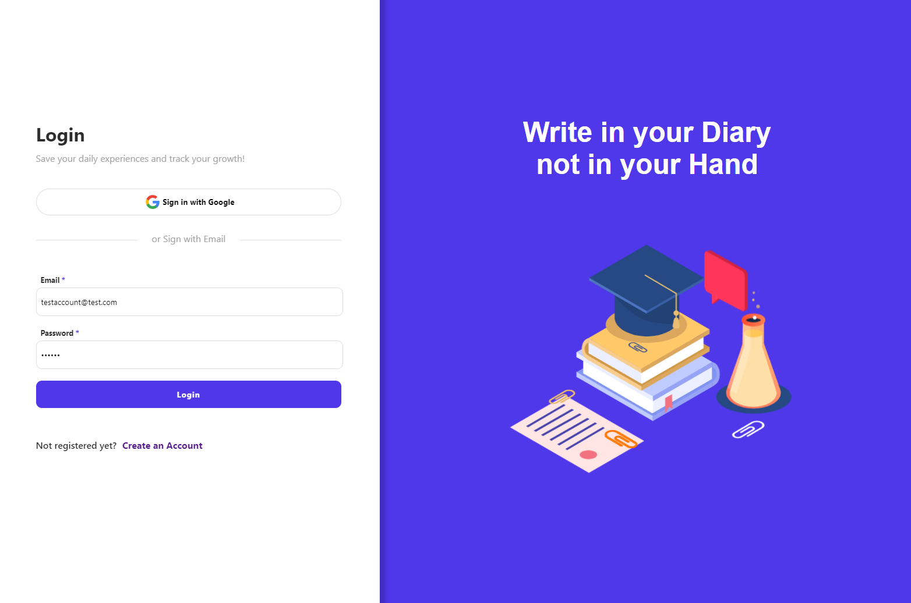
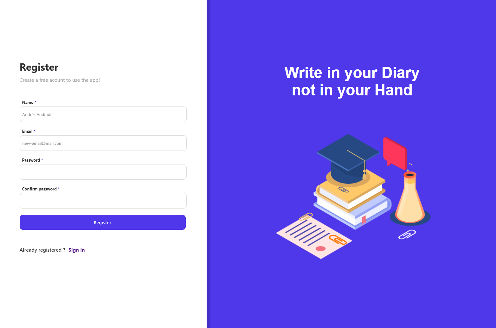
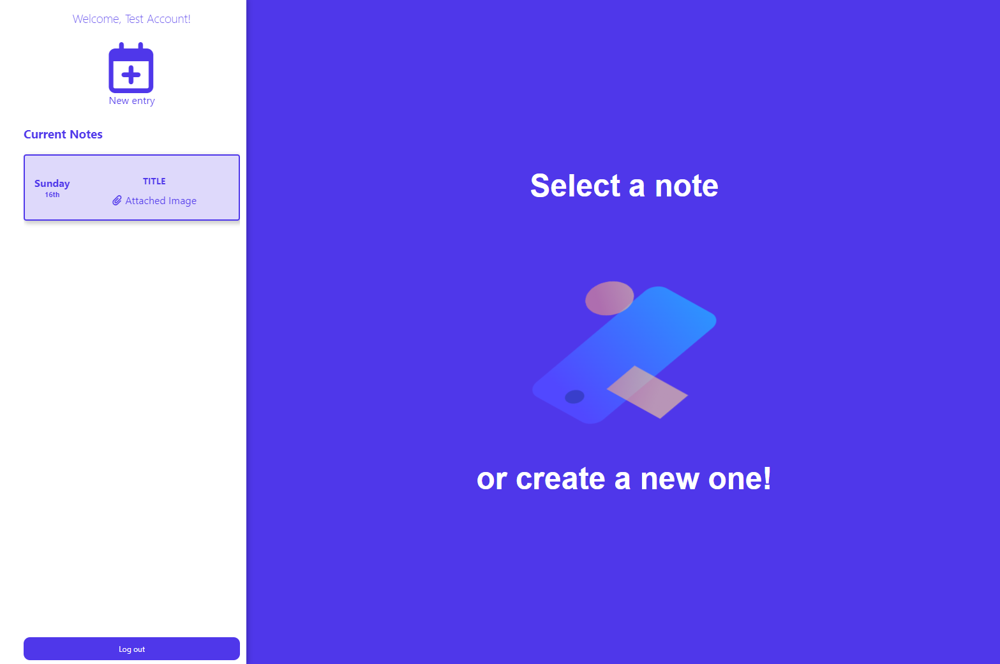

## :rocket: Journal-App


[](https://github.com/aaandrades/Journal-App/actions/workflows/node.js.yml)

### :memo: Description
Web application to collect and track a personal journal based on Firebase authentication with single-sign-on and email/password. You can create, read, edit, update and delete notes with title, body and images.



### :sparkles: Features
- Single-sign-on with Google
- Authentication
- Register
- CRUD
- Images Upload
- UI Modals
### :alembic: Core Concepts
- Redux pattern
- BEM Methodology
- Cloudinary
- Actions orchestration
- Firebase
- Lottie
- Mobile First
- Login/Register
- Testing
### :construction: Made with
- React 17.0.2
- node-sass 6.0.1
- Firebase 9.4.1
- React-redux 7.2.6
- Enzyme 3.11
- Redux-mock-store 1.5.4
- create-react-app scaffolding
- sweetalert2 11.1.2
- Redux-thunk 2.4.0
- React-lottie
- Jest
### :hammer: Demostration
You can enter directly to the link ```https://journal-project.netlify.app/```





### :bulb: Run the App
To run locally, clone the repo, execute ```npm install``` and then ```npm run start```.

*If you want to contribute to improve the project, please create your PR and write me :speech_balloon: . After it, sit down and take a beer, you deserve it!* :beers: .
*This project is for academic purposes only, all right reserved. Andrés Andrade 2021 :copyright::registered:*
